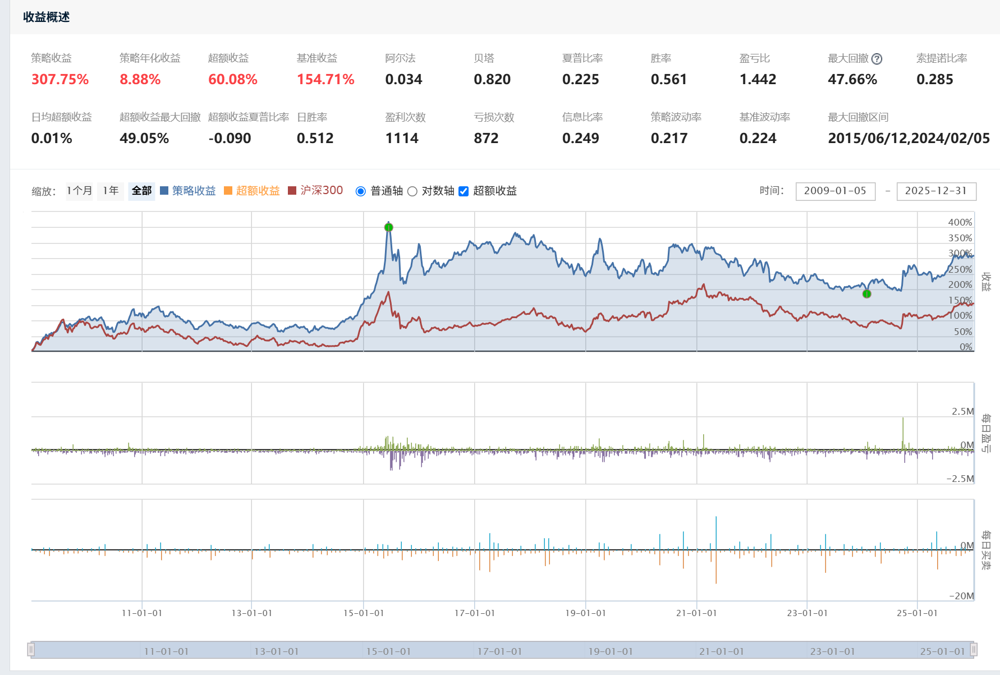

# 基线回测诊断

## 回测事实

- 区间：2009-01-01 至 2025-12-31
- 实际首个交易日：2009-01-05
- 初始资金：1000 万元
- 基准：沪深 300
- 策略累计收益：307.75%
- 策略年化收益：8.88%
- 基准累计收益：154.71%
- 最大回撤：47.66%
- Sharpe：0.225
- Sortino：0.285

## 分阶段观察

- 2009 年收益 108.99%，2015 年收益 68.89%。
- 除去 2009 和 2015，其他 15 年合计增长约 15.5%，收益高度集中。
- 2015 年底至 2025 年底策略约亏损 6.9%，同期沪深 300 约上涨 24.1%。
- 2015-06-12 至 2024-02-05 形成 47.66% 的峰值到谷底回撤；截至 2025 年底仍未恢复 2015 年高点。
- 2020 至 2023 年策略年化约 -5.1%，同期基准约 -4.3%。

## 组合与交易诊断

- 204 次月度调仓平均保留现金约 16.0%。
- 71 个月现金超过 20%，26 个月超过 30%，最高约 60%。
- 现金比例与同期沪深 300 月收益相关性约 -0.016，没有体现有效择时。
- 平均持仓约 176.8 天，平台换手率折算约为每年 2.1 倍单边换手。

## 推断

1. 收益主要来自少数深度价值和周期修复行情，跨市场环境稳定性不足。
2. 行业、模型和最低权重约束削减仓位后未重新分配，产生了非策略性的被动现金。
3. 估值指标高度相关，便宜因子被重复计权；持有缓冲又可能延长价值陷阱停留时间。
4. 当前策略更接近“深度价值加反转”，尚未充分表达“预期差加催化剂”。

## 下一步实验

按单变量顺序测试：

1. `allocator-redistribution`：只修复权重重新分配。
2. `catalyst-filter`：加入基本面改善或价格确认，并建立投资逻辑失效退出。
3. `portfolio-risk-overlay`：加入组合目标波动和市场风险覆盖层。
4. 最后测试交易阈值和无交易区间，降低无效换手。

优先观察最大回撤、最长水下期、最差滚动三年收益、2020-2025 表现、现金比例和换手，不以全样本累计收益最大化作为单一目标。
