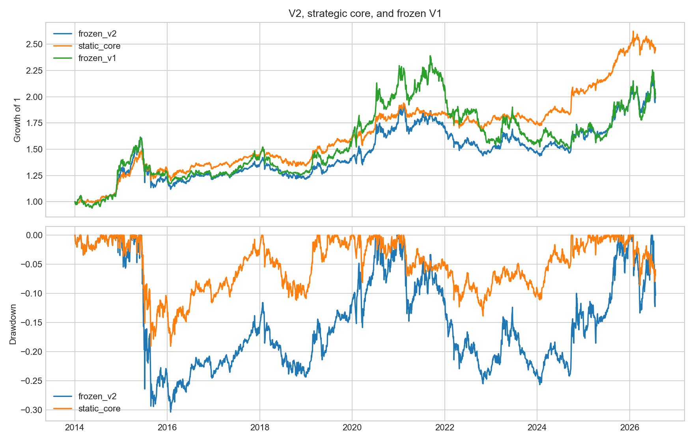
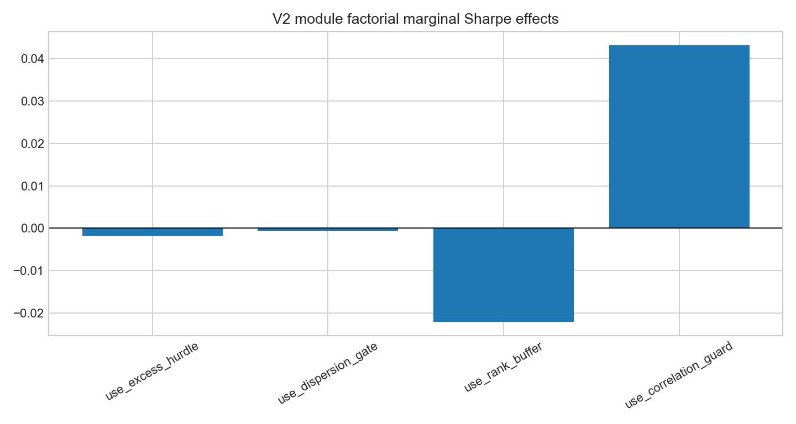
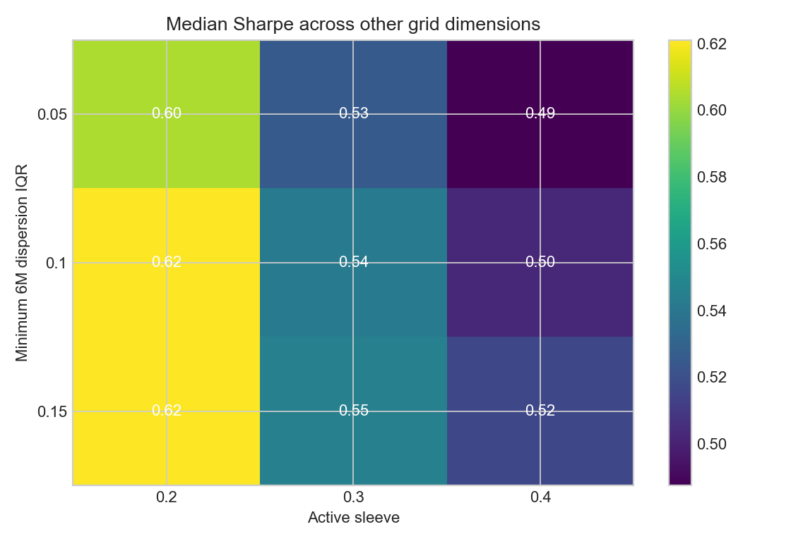
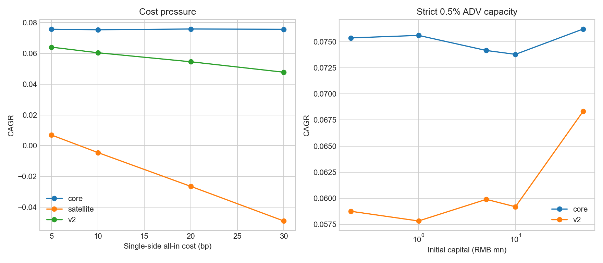
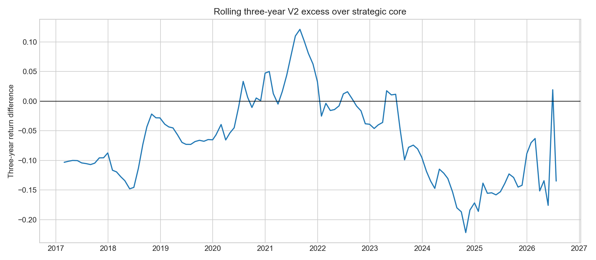

# ETF Core Rotation v2：条件式动量增强完整研究

## 结论先行

本报告严格使用提交 `0c06b5e` 中预注册的冻结候选和成功标准，不根据本次结果修改门控、底仓或参数。完整实验最终通过 **2/8** 项预注册标准：独立主动袖套 Sharpe 为正，以及本地、聚宽 Research、聚宽官方撮合的相对收益方向一致。其余六项失败，因此 **v2 不提升为 baseline**。

- 冻结 v2 年化 5.83%、最大回撤 30.36%、Sharpe 0.49；静态 40/40/20 底仓分别为 7.65%、19.06%、0.83。v2 年化增量为 -1.82%。
- 20bp 单边总成本下，v2/底仓年化为 5.45%/7.58%，净增量 -2.13%。
- 独立条件式主动袖套年化 -1.12%、回撤 66.27%、Sharpe 0.10。这一结果用于判断主动信号本身，而不是让底仓掩盖它。
- 滚动三年战胜底仓比例 20.18%，最差三年主动差额 -22.20%；负年度主动差额年份为 `[2015, 2016, 2018, 2019, 2021, 2022, 2023, 2024, 2025]`。
- 2,187 组参数试验的近似 PBO 为 27.14%，冻结候选 DSR 概率为 79.33%。
- 严格 0.5% ADV、1,000 万元场景下，v2 平均主动暴露 10.61%，年化相对严格底仓增量 -1.46%。
- 聚宽 PIT Research 中 v2/底仓年化为 6.50%/7.28%，主动差额 -0.79%；官方 10:30 配对回测为 6.65%/7.36%，主动差额约 -0.71%。两种平台结果都保留了本地 -1.82% 的负号，说明失败结论不是本地引擎独有现象。

## 冻结假设与实验规模

战略底仓固定为 40% 沪深300 ETF、40% 国债 ETF、20% 黄金 ETF；主动预算上限 30%。只有候选在至少 2/3 个周期跑赢 `max(0, 国债, 现金)` 且六个月收益横截面 IQR 不低于 10% 时才启用增强。主动 Top3 等权，单标的不超过 15%，未使用预算回到底仓。

直接回测共 2,309 条：本地 2,305 条，以及聚宽 Research/官方撮合各一组 v2 与同平台底仓配对结果。另报告 70 个 CSCV 分割、8 个 expanding-window 样本外年份和 4,000 次成对移动区块 bootstrap。

## 参考组合

| 模型 | 年化 | 最大回撤 | Sharpe | 年化换手 | 平均主动暴露 |
|---|---:|---:|---:|---:|---:|
| 冻结 v2 | 5.83% | 30.36% | 0.49 | 6.18 | 17.39% |
| 静态 40/40/20 底仓 | 7.65% | 19.06% | 0.83 | 0.22 | 0.00% |
| 独立主动袖套 | -1.12% | 66.27% | 0.10 | 22.05 | 60.77% |
| 冻结 v1 | 6.01% | 37.08% | 0.46 | 18.97 | — |

## 模块全因子边际

下表控制其他三个开关后报告 8 组配对平均差；不是一条顺序消融路径。

| 模块 | 平均Δ年化 | 平均ΔSharpe | Sharpe改善比例 |
|---|---:|---:|---:|
| use_excess_hurdle | -0.07% | -0.002 | 50.00% |
| use_dispersion_gate | -0.27% | -0.001 | 50.00% |
| use_rank_buffer | -0.29% | -0.022 | 0.00% |
| use_correlation_guard | 0.51% | 0.043 | 100.00% |

## 参数高原、多重试验与样本外

- 网格维度严格为协议中的 3×3×3×3×3×3×3，共 2,187 组；冻结候选在网格中精确出现一次并逐日复现详细账本。
- 网格 Sharpe 中位数 0.56，四分位区间 0.50—0.61；全样本冠军为 `grid_1762`，但不替换冻结候选。
- expanding-window 选参 OOS 年化/回撤/Sharpe 为 7.30%/23.33%/0.66；同期冻结 v2 为 6.92%/25.65%/0.56，静态底仓为 8.51%/13.86%/0.99。
- 21/63 日成对移动区块 bootstrap 的主动年化均值为 -1.24%/-1.24%，95% 区间为 [-4.58%, 2.94%] / [-4.85%, 2.12%]。

## 成本、容量、集中度与阶段性

- 成本表在 `raw/cost-stress.csv`；静态底仓也按相同成本重放，避免只惩罚 v2。
- 1,000 万严格容量下最大实际成交参与率为 0.50%，超出 0.5% 的成交数为 0。
- 主动正贡献 Top1/Top3/Top5 占比为 10.64%/24.77%/36.51%；删除贡献最高 ETF 后的年化底仓增量为 -1.79%。
- 滚动三年、逐年、牛熊震荡、ADV 门槛和执行延迟的完整结果分别保存在 `raw/rolling-three-year.csv`、`raw/yearly.csv`、`raw/regimes.csv`、`raw/liquidity-stress.csv` 和 `raw/execution-lag.csv`。

## 聚宽平台校准

| 环境 | v2 年化 | 底仓年化 | 年化差额 | v2 回撤 | 底仓回撤 | 结论 |
|---|---:|---:|---:|---:|---:|---|
| 本地因果日频重放 | 5.83% | 7.65% | -1.82% | 30.36% | 19.06% | 负 |
| 聚宽 PIT Research 开盘代理 | 6.50% | 7.28% | -0.79% | 30.41% | 19.52% | 负 |
| 聚宽官方周一 10:30 | 6.65% | 7.36% | -0.71% | 30.76% | 19.39% | 负 |

- Research 重放使用 `finance.FUND_INVEST_TARGET` 的公告日和生效区间做时点分类，产物无查询警告；平台 ZIP 为 `exports/etf-core-v2-jq-research-open-2014-2026-v1.zip`，其 `comparison.json` 已复制为 `raw/joinquant-research-comparison.json`。
- 官方 v2 回测 ID 为 `29729f6a170c46181784301d3e687fe8`，同配置底仓 ID 为 `1ab66e966feb745a671ebb9ceaccb3f3`。官方页面年化和回撤只显示到百分比小数点后两位，因此差额按页面展示值计算。
- 三个环境的绝对数值有执行时点、分类档案和平台指标口径差异；预注册平台标准只检验相对底仓的符号是否反转。三者均为负，因此平台标准通过，但这不是对 v2 收益能力的肯定。

完整平台证据见 `raw/platform-calibration.json`。

## 预注册成功标准

| 标准 | 状态 | 机器值 |
|---|---|---|
| cost_adjusted_increment | 失败 | `-0.021277045498286462` |
| rolling_three_year | 失败 | `{"win_ratio": 0.20175438596491227, "worst_active_excess": -0.22200156930257642}` |
| risk_improvement | 失败 | `{"passed_components": 0, "components": [false, false, false]}` |
| standalone_satellite | 通过 | `[0.09583395268589785, 0.03936719371594921]` |
| multiple_testing | 失败 | `[0.2714285714285714, 0.7933335003330279]` |
| concentration | 失败 | `[0.10639323434887307, -0.017931070113406333]` |
| capacity | 失败 | `[0.1060861725183298, -0.014606842362147487]` |
| platform | 通过 | `[-0.007873985195820277, -0.0071]` |

`platform` 的定义是“不反转本地冻结候选相对底仓的符号”，而不是“平台上必须跑赢底仓”。本地、Research 和官方回测均为负差额，所以该项机械通过。

## 偏差审计与限制

- 每次周频决策的观察日严格早于执行日；动量、ADV、相关性、分散度和防御门槛都只截止观察日。详细账本归因误差和持仓生命周期检查见 `audit.json`。
- 本地行情、复权、动量、波动率和 ADV 已在 v1 阶段与聚宽几乎逐位对齐；本地 `tracking_target` 仍是当前静态档案，因此不能单独视为严格分类 PIT。此次聚宽 Research 已使用历史 `FUND_INVEST_TARGET` 完成全路径校准，结果仍低于同平台底仓。
- 主动/底仓持有同一 ETF 时，详细账本按目标权重比例拆分虚拟袖套贡献；总账户 P&L 精确对账，虚拟袖套归因是分析口径，不是独立托管账户。
- 全部稳健性试验仍来自同一 2014—2026 历史；walk-forward 和 PBO 降低但不能消除数据挖掘风险。

## 决策

按预注册八项标准，v2 仅通过 2 项、失败 6 项，结论为 **拒绝提升为 baseline，保留为失败但有研究价值的冻结变体**。全样本冠军、某个更优延迟或参数单点都不会写回冻结候选；唯一稳定为正的相关性约束边际可作为未来新假设的线索，但不能用于修补本次 v2。
