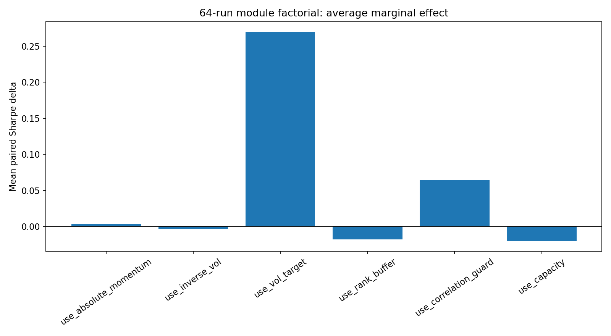
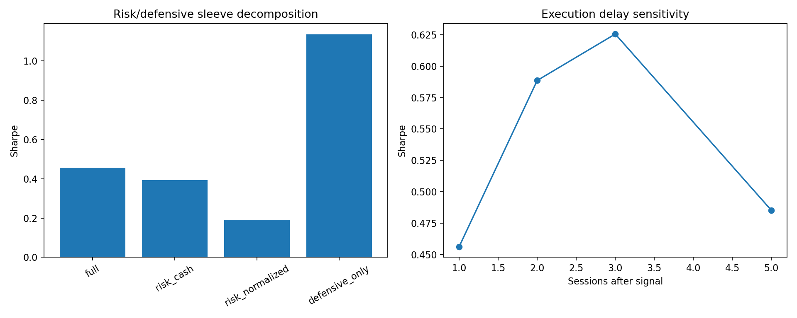
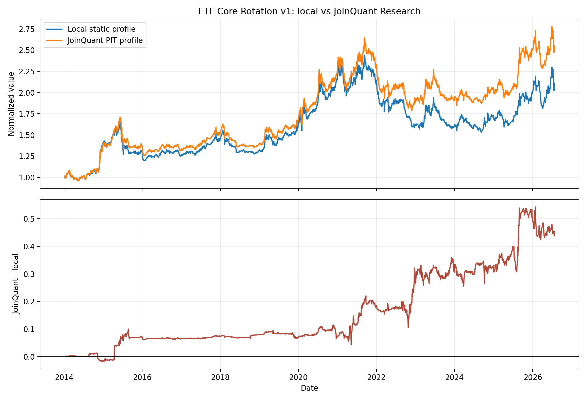

# ETF Core Rotation v1：平台校准与收益来源分解

## 结论先行

这一轮没有改动或调优 baseline v1，而是完成了模块全因子、收益来源、执行延迟、低复杂度基准，以及聚宽历史点时数据和全路径重放。结论比第一阶段更明确：

- **暂不建议直接实盘。** 本地冻结 baseline 年化 6.01%、最大回撤 37.08%、Sharpe 0.46，跑输沪深 300 ETF 买入持有的 7.76% 年化；第一阶段 PBO 为 52.86%，冻结 baseline 的 DSR 概率为 67.87%。
- **稳定边际主要来自风险覆盖层，而不是相对动量本身。** 64 个模块组合在四个时期上的 256 次全因子结果中，波动率目标平均提高 Sharpe 0.269、32/32 对照均为正；相关性约束平均提高 0.064、也是 32/32 为正。绝对动量和逆波动率的全样本平均边际接近零。
- **防御袖套是风险调整收益的重要来源。** 单独持有防御袖套年化 2.87%、回撤 8.05%、Sharpe 1.14；把风险腿归一化到接近满仓后只得到 1.23% 年化、61.19% 回撤和 0.19 Sharpe。策略不能被描述成“动量腿本身很强”。
- **聚宽历史点时分类显著改变持仓，但没有推翻总体判断。** 聚宽 Research 全路径重放年化 7.79%、回撤 32.42%、Sharpe 0.58，优于本地静态档案版；但两者只有 64.23% 的周度最终持仓完全一致，平均目标权重 L1 差为 21.52%。这不是可据以调参的“增益”，而是数据口径风险。
- **保守成本和大资金下实用价值快速下降。** 第一阶段 30bp 单边总成本下年化仅 2.87%、Sharpe 0.26；严格限制每笔风险交易不超过 ADV20 的 0.5% 后，5,000 万元场景平均风险权重只有 10.03%，组合实质转为防御资产。

综合判断：v1 是一个有一定趋势择时信号、但收益质量主要由波动率目标和防御资产支撑的低至中等质量研究原型。它目前更适合作为后续研究基准，而不是可直接投入真实资金的成品。

## 研究范围与试验次数

第一阶段保留 1,322 次直接本地回测，包括 1,296 组预注册参数网格、逐层消融、成本、容量和贡献 ETF 删除。第二阶段新增：

| 实验族 | 结果数 |
|---|---:|
| 6 个模块的 64 个全因子组合 × 4 个时期 | 256 |
| 4 种风险/防御分配 × 4 个时期 | 16 |
| 4 种执行延迟 × 4 个时期 | 16 |
| 低复杂度买入持有基准 | 3 |
| 本地历史时点探针 | 17 |
| 聚宽历史时点探针 | 17 |
| 聚宽 Research 全路径重放 | 1 |
| 聚宽官方周一 10:30 回测 | 1 |

共完成 1,649 次有效实验执行；第一次错误上传/编译产生的零收益结果不计入有效实验。PBO 的 70 个 CSCV 半样本组合和 8 个 expanding-window 样本外年份另行报告，不重复计入回测次数。

## 全因子模块贡献

下表是全样本中控制其他五个模块开关后的 32 组配对平均差，而不是单条逐层消融路径：

| 模块 | 平均 Δ年化 | 平均 Δ回撤 | 平均 ΔSharpe | Sharpe 改善比例 |
|---|---:|---:|---:|---:|
| 波动率目标 | +5.33% | -19.89% | +0.269 | 100% |
| 相关性约束 | +1.63% | -5.43% | +0.064 | 100% |
| 绝对动量 | -0.08% | +0.94% | +0.003 | 50% |
| 逆波动率 | -0.01% | -0.95% | -0.003 | 50% |
| 排名缓冲 | -0.45% | +4.06% | -0.018 | 28% |
| 容量缩放 | -0.66% | -7.27% | -0.020 | 16% |

波动率目标跨三个分段仍为正边际，是唯一非常清晰的模块。相关性约束在 2018—2021 分段略为负，但全样本和 2022—2026 明显为正，属于次一级证据。排名缓冲把年化换手平均降低约 8.65 倍，价值主要在执行摩擦而非提高回测 Sharpe。容量缩放减少回撤，同时牺牲收益和风险暴露，不能被包装成独立 alpha。

## 收益来源：风险腿、防御腿与基准

| 组合 | 年化 | 最大回撤 | Sharpe |
|---|---:|---:|---:|
| 冻结 baseline | 6.01% | 37.08% | 0.46 |
| 风险腿 + 现金 | 5.09% | 39.40% | 0.39 |
| 风险腿归一化近满仓 | 1.23% | 61.19% | 0.19 |
| 仅防御袖套 | 2.87% | 8.05% | 1.14 |
| 沪深 300 ETF 买入持有 | 7.76% | 45.44% | 0.45 |
| 60/40 股债买入持有 | 6.27% | 33.61% | 0.47 |
| 国债 ETF 买入持有 | 3.46% | 4.90% | 1.45 |

冻结 baseline 相对 60/40 股债没有明显风险调整优势。风险腿加杠杆式归一化后显著恶化，说明 vol target 通过降低风险暴露创造了大部分风险调整改善；它并非只是给一个已经很强的动量组合做微调。

## 执行延迟稳定性

| 信号后执行交易日 | 年化 | 回撤 | Sharpe |
|---:|---:|---:|---:|
| 1 | 6.01% | 37.08% | 0.46 |
| 2 | 8.00% | 29.55% | 0.59 |
| 3 | 8.60% | 27.15% | 0.63 |
| 5 | 6.44% | 31.22% | 0.49 |

1—5 个交易日延迟均保持正年化，说明策略不依赖某一个精确开盘点。2—3 日反而改善不能用来把 baseline 改成 3 日延迟；它更可能说明短期价格噪声和本地分类误差很大，精确择时没有稳健证据。

## 聚宽点时数据校准

17 个历史时点全部在聚宽 Python 3 Research 成功运行，`finance.FUND_INVEST_TARGET`、历史 ETF 列表和历史行情均可访问。1,125 条聚宽候选记录与本地比较得到：

- 候选池平均 Jaccard 93.18%，Top10 平均 Jaccard 86.06%；
- 共同 ETF 的 63/126/252 日收益差中位数均为 0；
- 共同 ETF 排名 Spearman 中位数为 0.99939；
- vol60 差约为 `5e-16`，ADV20 相对差中位数约 `3.6e-10`。

因此，本地价格、复权、动量、波动率和 ADV 计算几乎逐位复现聚宽。剩余差异主要来自本地 `tracking_target` 是当前静态档案，而聚宽用 `pub_date/start_date/end_date` 重建历史分类和同指数去重。

聚宽全路径重放有 644 个周频决策；去除研究起始边界多出的一次 2014-01-02 决策后，643 个观察日与本地全部匹配，执行日期完全一致。结果如下：

| 指标 | 本地静态档案 | 聚宽 PIT 档案 |
|---|---:|---:|
| 年化 | 6.01% | 7.79% |
| 最大回撤 | 37.08% | 32.42% |
| Sharpe | 0.46 | 0.58 |
| 最终持仓完全一致 | — | 64.23% |
| 平均目标权重 L1 差 | — | 21.52% |
| 日收益相关系数 | — | 0.9637 |
| 年化主动收益跟踪误差 | — | 4.10% |

这说明本地行情环境可靠，但静态分类足以造成实质净值差。聚宽较好的结果是一次数据口径校准结果，不是样本外发现，也不能反向用来选择参数。

## 聚宽官方周一 10:30 回测

冻结的 `source.py` 已在聚宽官方策略回测环境按周一 10:30 调仓完成全区间运行，回测 ID 为 [`af52481f53268d1b7e49ed20dd8ae097`](https://www.joinquant.com/algorithm/backtest/detail?backtestId=af52481f53268d1b7e49ed20dd8ae097)。

| 指标 | 聚宽官方结果 |
|---|---:|
| 区间 | 2014-01-02—2026-07-24 |
| 初始资金 | 100 万元 |
| 累计收益 | 115.27% |
| 年化收益 | 6.48% |
| 最大回撤 | 30.56% |
| 最大回撤区间 | 2021-09-09—2022-11-28 |
| Sharpe | 0.167 |
| Sortino | 0.215 |
| 年化波动率 | 14.8% |
| Alpha / Beta | 0.017 / 0.441 |

官方 10:30 年化为 6.48%，介于本地静态分类的 6.01% 与聚宽 Research PIT 重放的 7.79% 之间，最大回撤也低于两条日线代理路径。方向上，这说明平台正式撮合没有推翻“有正收益但优势有限”的结论；但不能把差额完全归因于 10:30 成交，因为官方回测同时包含平台自己的分钟价格、订单撮合和指标口径。

聚宽页面的 Sharpe/Sortino 使用平台口径，本地和 Research 报告的是零无风险利率日收益口径，因此 0.167 不能与 0.46/0.58 直接比较。机器可读摘录保存在 `raw/joinquant-official-summary.json`。

## 参数、成本、容量、集中度与样本外

- 1,296 组完整参数网格全部为正年化，Sharpe 中位数 0.50、四分位区间 0.43—0.56，形成“正收益但风险调整收益偏低”的宽平台。所有组合共享防御袖套和风险覆盖层，因此不能据此宣称各个动量参数都有效。
- 5/10/20/30bp 单边成本下年化分别为 7.72%/6.59%/4.78%/2.87%，Sharpe 为 0.57/0.49/0.38/0.26。对交易成本高度敏感。
- 严格 0.5% trade/ADV 下，20 万、100 万、500 万、1,000 万和 5,000 万场景均无参与率违规；但 5,000 万场景年化 2.32%，平均风险权重仅 10.03%。
- 风险 ETF 正贡献 Top1/Top3 占 11.19%/22.00%；删除 Top1/Top3/Top5 后重新排名回测，年化为 5.62%/5.98%/5.05%，没有依赖单一 ETF，但整体优势仍弱。
- 本地负收益年份为 2015、2016、2018、2021、2022、2023；聚宽 PIT 路径改善了 2015、2021、2022、2023 和 2025，但没有消除阶段性失效。
- 2019—2026 expanding-window 选参 OOS 年化 7.54%、回撤 45.75%、Sharpe 0.54；同期冻结 baseline 为 6.41%、37.08%、0.45。选参提高收益但扩大回撤，没有形成压倒性样本外改进。
- 1,296 次试验的近似 PBO 为 52.86%；冻结 baseline / 全样本冠军 DSR 概率为 67.87%/93.91%，都不足以证明可稳定外推。

## 偏差与实施边界

- 生命周期、价格、ADV 和信号时点按历史观察日处理；本地包含历史退市 ETF，未发现持仓越过生命周期。
- 本地分类不是严格 PIT，已由聚宽点时探针和全路径差异量化，不能再把本地结果称为聚宽严格复现。
- 本地和 Research 全路径均是日线开盘代理；聚宽官方周一 10:30 结果已完成，但平台只展示汇总指标，不能仅凭净值摘要逐笔拆分 10:30 价格、涨跌停、停牌和订单资金不足各自造成的差异。
- Research 重放在起始周多执行了一次 2014-01-02，完整路径比较从首个共同执行日 2014-01-06 归一化；该边界差异没有混入持仓一致率统计。
- 所有稳健性试验仍使用同一段 2014—2026 历史，不是真实发布后的前瞻业绩。

## 后续研究建议

如果继续这个方向，不应再扩大 v1 参数网格。优先级应是：

1. 把聚宽历史 `FUND_INVEST_TARGET` 快照变成本地可重复的数据层，消除候选池口径漂移；
2. 将“风险腿”“防御腿”和静态 60/40 分别设为独立基准，只有风险腿在滚动和样本外显著增益时才设计 v2；
3. v2 若立项，应冻结新假设后重新做 walk-forward，并预留真正发布后的前瞻观察期，而不是把本轮 2/3 日延迟或全样本冠军写回 v1。

在上述工作完成前，v1 的实用价值是研究基准和低风险资产配置框架，不是已经验证的高质量 ETF 动量产品。

## 归档

- `raw/local/`：模块全因子、收益来源、执行延迟、基准和本地探针；
- `raw/joinquant/`：17 个聚宽历史时点的候选与指标；
- `raw/joinquant-replay/`：聚宽 Research 全路径净值、订单、成交、持仓与决策；
- `raw/joinquant-official-summary.json`：聚宽官方周一 10:30 回测 ID、页面指标与口径限制；
- `raw/platform-comparison-*` 与 `raw/replay-comparison.*`：点时和全路径对账；
- `assets/`：模块、收益来源/执行延迟以及本地—聚宽净值对比图；
- `config.json`、`audit.json`、`manifest.json`：冻结参数、数据审计、试验次数和文件哈希。
